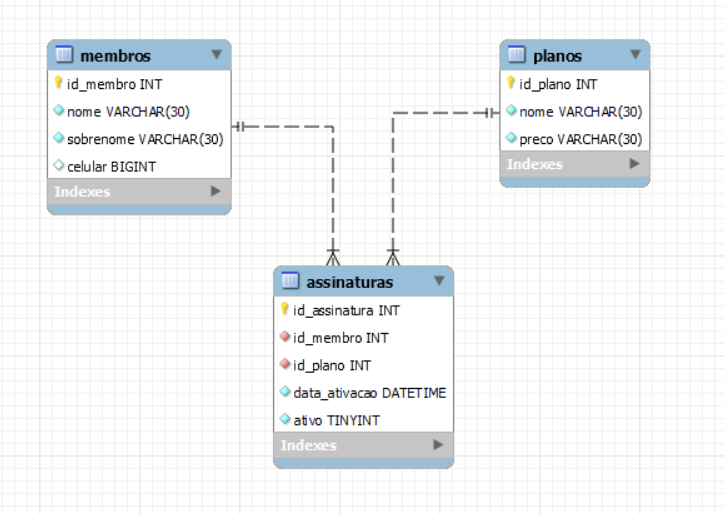

# Gym CRUD

#### API for managing members, plans and subscriptions for a gym, using FastAPI and SQLAlchemy

## Routes

### Members

- `GET /members` - List all members
- `GET /members/{member_id}` - Get a member by id
- `POST /members/create` - Create a member
- `PUT /members/update/{member_id}` - Update a member by id
- `DELETE /members/delete/{member_id}` - Delete a member by id

### Plans

- `GET /plans` - List all plans
- `GET /plans/{plan_id}` - Get a plan by id
- `POST /plans/create` - Create a plan
- `PUT /plans/update/{plan_id}` - Update a plan by id
- `DELETE /plans/delete/{plan_id}` - Delete a plan by id

### Subscriptions

- `GET /subscriptions` - List all subscriptions
- `GET /subscriptions/{subscription_id}` - Get a subscription by id
- `POST /subscriptions/create` - Create a subscription
- `PUT /subscriptions/update/{subscription_id}` - Update a subscription by id
- `DELETE /subscriptions/delete/{subscription_id}` - Delete a subscription by id

## How to run

- Clone this repository
- Install the dependencies with `pip install -r requirements.txt`
- Create a `.env` file with the following environment variables:
    <ul>
        <li>SERVER (can be "localhost" or an IP)</li>
        <li>USERNAME (the username for the database)</li>
        <li>PASSWORD (the password for the database)</li>
        <li>DB (the name of the database)</li>
    </ul>
- Run the server with `uvicorn main:app --reload`
- Access the docs at `http://localhost:8000/docs` or `http://localhost:8000/redoc`